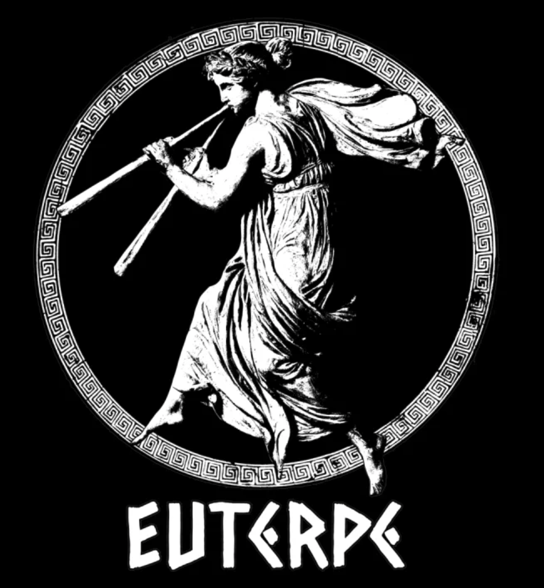

"_Somos poeira de estrelas que se organizou para entender o Universo. Essa busca pelo conhecimento é o que nos define. Não somos nada diante da vastidão cósmica, mas ao mesmo tempo somos tudo, porque carregamos em nós a chama da curiosidade e do desejo de compreender_."

>(Sêneca; Aurélio, M; Sagan, C.; Gleiser, M.)