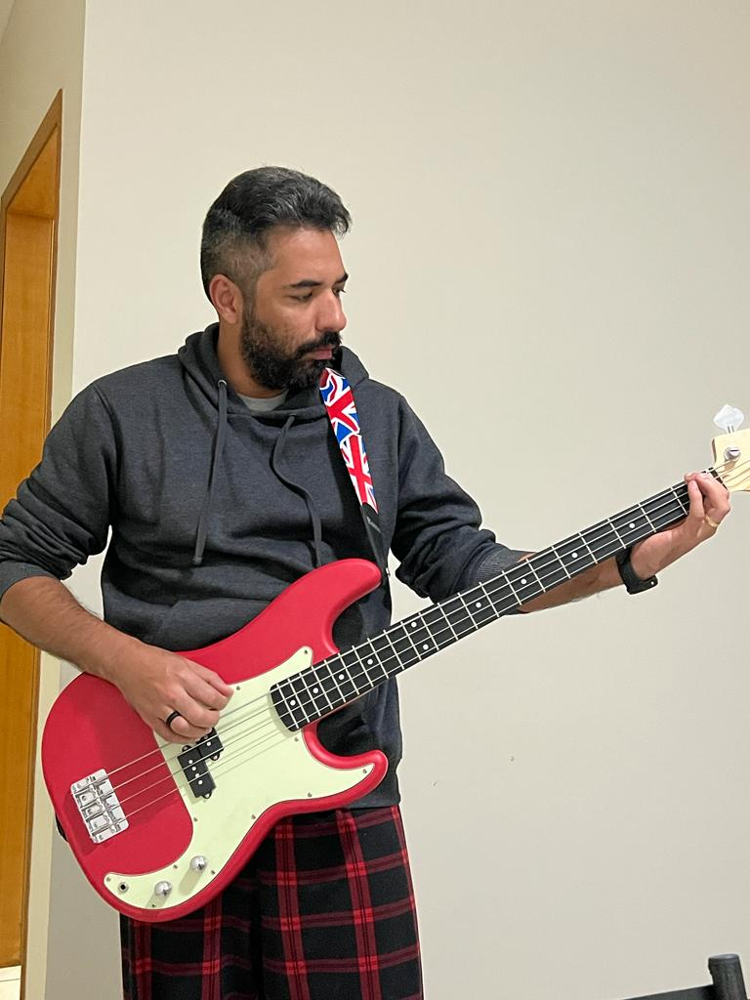

## Sobre Mim
<!--- ## About Me -->

Sou professor do magistério superior da Universidade Federal do Oeste do Pará, lotado no Instituto de Biodiversidade e Florestas na unidade Tapajós em Santarém-PA. Estou cursando segundo doutorado no Programa de Pós-Graduação em Estatística e Experimentação Agronômica (PPGEA) pela Escola Superior de Agricultura "Luiz de Queiroz" (Esalq/USP) em Piracicaba-SP.

<!-- This is a jekyll based resume template. You can find the full source code on [GitHub](https://github.com/bk2dcradle/researcher) -->

## Interesses de Pesquisa
<!-- ## Research Interest -->

Desenvolvo pesquisas sobre Agroecologia, fruticultura, manejo e produção de açaí, aproveitamento de resíduos do menejo de açaizais nativos, processamento e fabricação de painéis laminados e colados de ripas de caule de aácizeiro e aplicação de modelos estatísticos para estimaçãao de redimento de caules de açaizeiro e predição do volume de suas ripas processadas.

<!-- ## Publications

1. F.Bar, J.Doe: Effects of having a placeholder of a name
2. S.Holmes, J.Watson: Consequences of living with a sociopath in London -->

## Formação Acadêmica
<!-- ## Academic Backgroung -->

- 🎓 **Doutorado em Estatística e Experimentação Agronomica**
  📍 Escola Superior de Agricultura "Luiz de Queiroz" (Esalq/USP)
  📅 2022 - atual

-🎓 **Doutorado em Ciências Agrárias**
  📍 Universidade Federal Rural da Amazônia (UFRA)
  📅 2011 - 2015

-🎓 **Mestrado em Agroecologia**
  📍 Universidade Estadual do Maranhão (UEMA)
  📅 2007 - 2009

-🎓 **Graduação em Agronomica**
  📍 Universidade Federal Rural da Amazônia (UFRA)
  📅 2002 - 2006

<!-- This is a [link](http://google.com). Something *italics* and something **bold**. -->

<!-- Here is a table

Year | Award | Category
-----|-------|--------
2014 | Emmy  | Won Outstanding Lead Actor in a miniseries or a movie
2015 | BAFTA | Nominated for Best Leading Actor for Sherlock
2014 | Satellite | Won Best Actor miniseries or television film

Here is a horizontal rule

---

-->

<!-- Here is a blockquote -->

> All models are wrong, but some are usefull (Box, G. E. P.)

<!-- ## References

* Foo Bar: Head of Department, Placeholder Names, Lorem
* John Doe: Associate Professor, Department of Computer Science, Ipsum
-->
